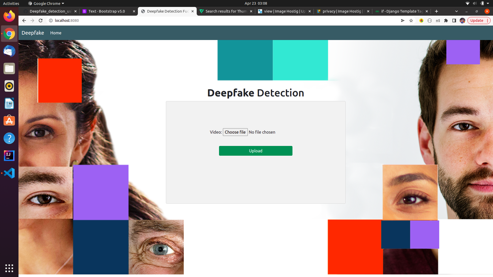
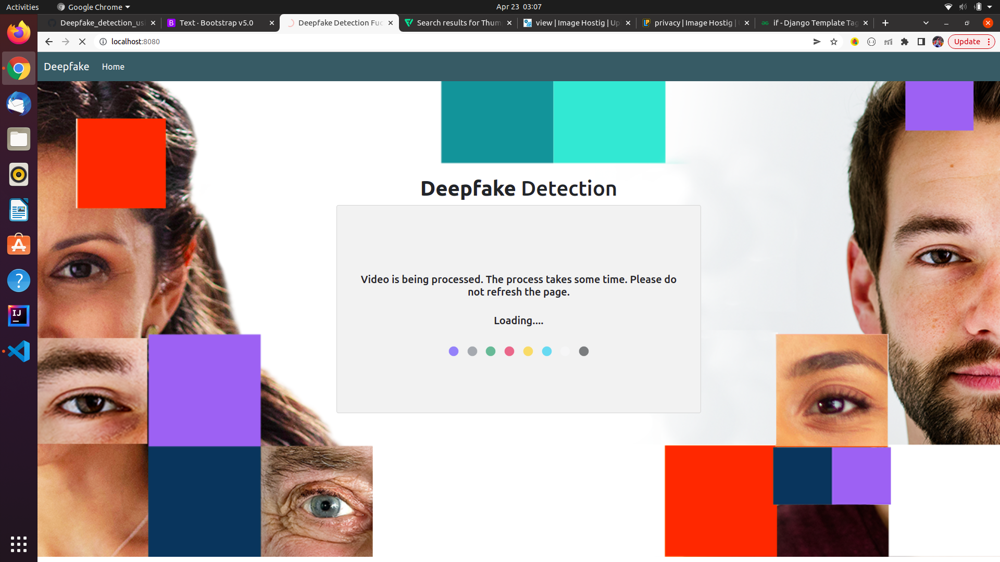
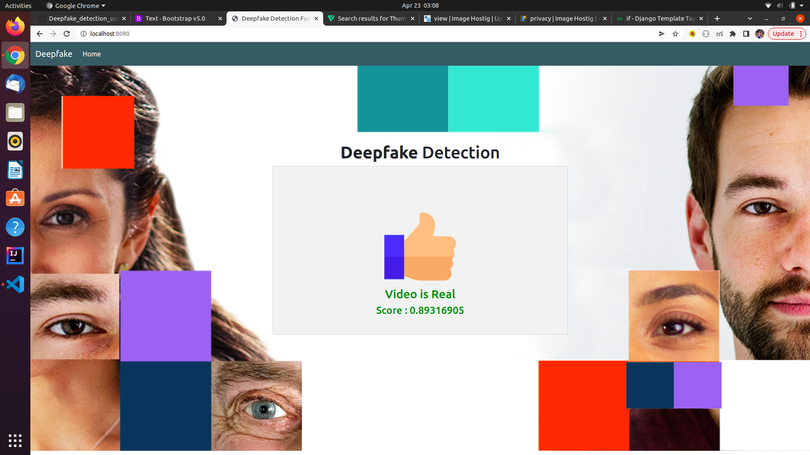

# Web Application for Deepfake Detection

### Running Project Locally 
First clone the repository to your local
```bash
git clone https://github.com/sreejan774/DeepfakeWebApp.git
```
Install the requirements:

```bash
pip install -r requirements.txt
```

Make Migrations

```bash
python manage.py makemigrations
```

Create the database:

```bash
python manage.py migrate
```
Finally, run the development server:

```bash
python manage.py runserver
```
The project will be available at **127.0.0.1:8000**.

## ScreenShots  
Home page
---


Intermediate page
---


Result page
---


